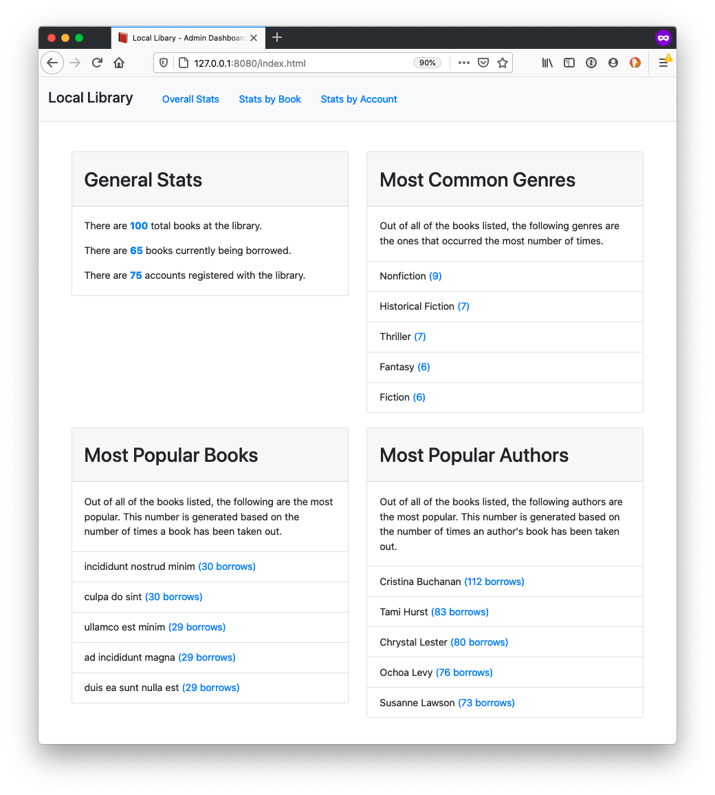

# Local_library_Project

Local Library assembles the functionality for an application that allows users to search, review and check out books from their local neighborhood.

## Functions

Created search and sorting functions to allow users to know book availability and rating.

## Home View

## Built with:

JavaScript ES6, Bootstrap, HTML5, Node.js

